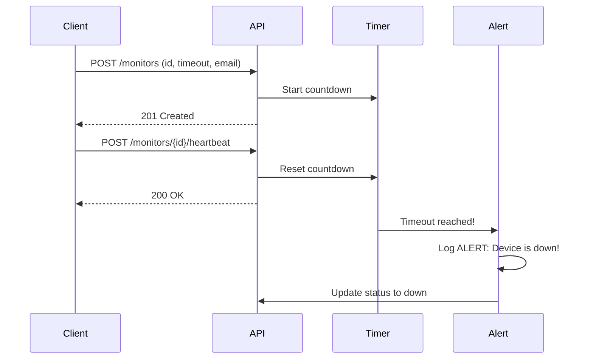

# Pulse-Check-API (Watchdog Sentinel)

A Dead Man’s Switch API built with FastAPI and Python.
Monitors remote devices and triggers alerts when they stop sending heartbeats.

## Architecture Diagram



## Setup Instructions

1. Clone the repository
1. Create virtual environment: `python -m venv venv`
1. Activate: `venv\Scripts\activate`
1. Install dependencies: `pip install -r requirements.txt`
1. Run server: `uvicorn app:app --reload`
1. Visit docs: `http://127.0.0.1:8000/docs`

## API Documentation

|Method|Endpoint                |Description           |Response   |
|------|------------------------|----------------------|-----------|
|POST  |/monitors               |Register a new monitor|201 Created|
|GET   |/monitors/{id}          |Get monitor status    |200 OK     |
|POST  |/monitors/{id}/heartbeat|Reset countdown timer |200 OK     |
|POST  |/monitors/{id}/pause    |Pause monitoring      |200 OK     |

## Example Request

```json
POST /monitors
{
  "id": "device-123",
  "timeout": 60,
  "alert_email": "admin@critmon.com"
}
```

## Developer’s Choice Feature

Added `GET /monitors/{id}` status endpoint. This allows support engineers to check the current state of any device in real time without waiting for an alert. It returns the device ID, current status, timeout value and alert email.


## User Stories & Acceptance Criteria

### User Story 1: Registering a Monitor
As a device administrator,
I want to create a new monitor for my device,
So that the system knows to track its status.

**Acceptance Criteria:**
- The API accepts a `POST /monitors` request
- Input: `{"id": "device-123", "timeout": 60, "alert_email": "admin@critmon.com"}`
- The system starts a countdown timer for 60 seconds associated with device-123
- Response: `201 Created` with a confirmation message

### User Story 2: The Heartbeat (Reset)
As a remote device,
I want to send a signal to the server,
So that my timer is reset and no alert is sent.

**Acceptance Criteria:**
- The API accepts a `POST /monitors/{id}/heartbeat` request
- If the ID exists, the countdown restarts from the beginning
- Response: `200 OK` with a confirmation message

### User Story 3: The Alert
As a system administrator,
I want to be notified when a device goes silent,
So that I can investigate and fix the issue.

**Acceptance Criteria:**
- When the timer expires with no heartbeat, an alert is triggered
- The alert logs the device ID and timestamp
- The device status changes to `down`

### User Story 4: Pause Monitoring
As a device administrator,
I want to pause monitoring during maintenance,
So that I don't receive false alerts.

**Acceptance Criteria:**
- The API accepts a `POST /monitors/{id}/pause` request
- The countdown timer is cancelled
- The device status changes to `paused`
- Response: `200 OK` with a confirmation message